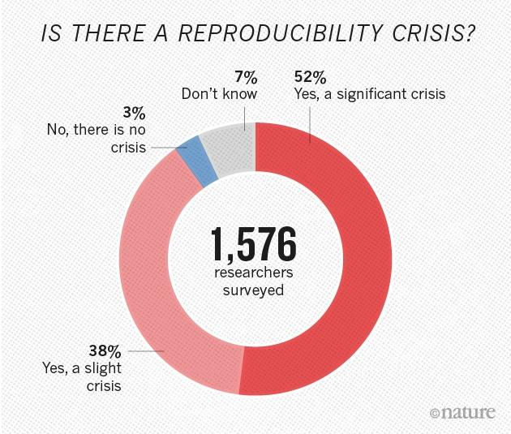
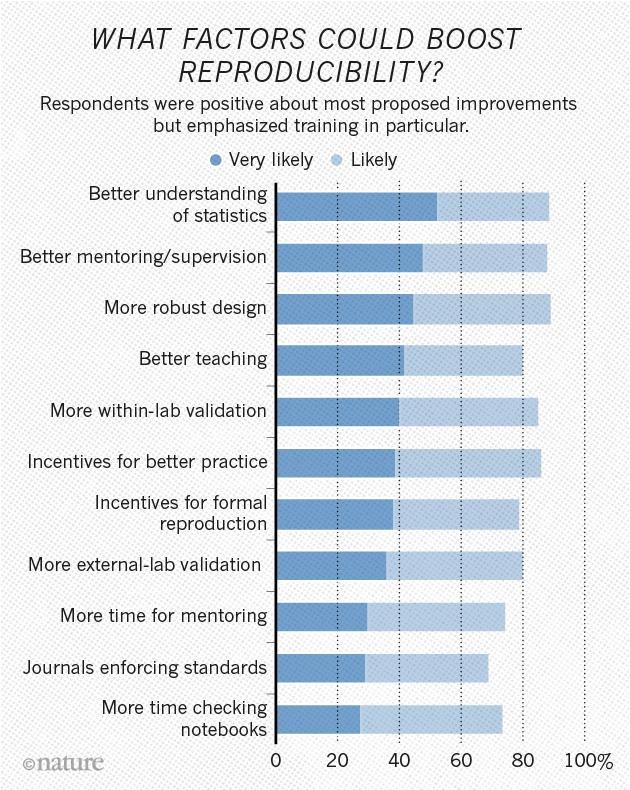
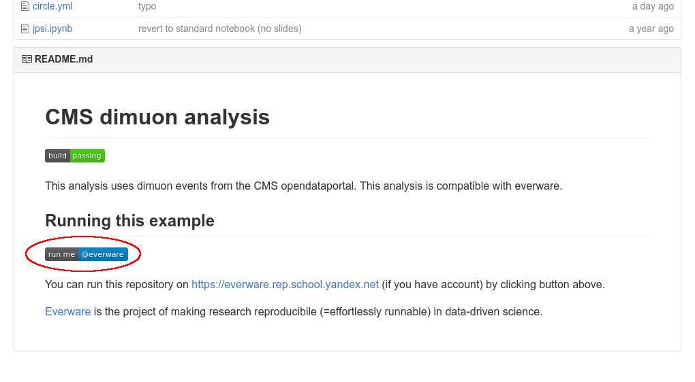
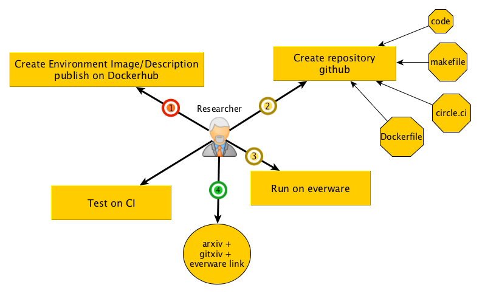
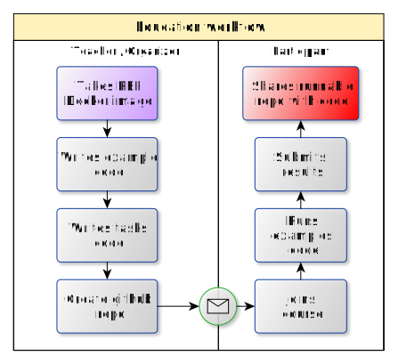
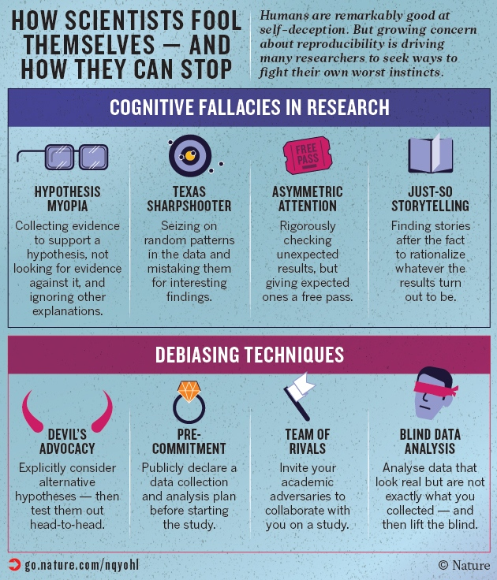

class: center, middle, no-number

.header[

]

&nbsp;

.title[Reproducible Machine Learning for Humans]

<!-- .remark-slide-number[abc] -->

.author[Nikita Kazeev on behalf on the Everware and REP teams]

.email[[kazeevn@yandex-team.ru](mailto:kazeevn@yandex-team.ru)]
&nbsp;

&nbsp;
.date[2016-10-13, 4th National eScience Symposium, Amsterdam, the Netherlands]

---
count: false
layout: true
.header-right[Nikita Kazeev, YSDA, Reproducible Machine Learning for Humans]
---

## Yandex
.libig[
- A Dutch company (according to NASDAQ)
- The leading web search engine in Russia
- Image search
- Speech recognition
- Car traffic prediction
- Mail and spam filtering
- Natural language translation
- [Yandex Data Factory](https://yandexdatafactory.com) -
  data science for business
- **Yandex School of Data Analysis**
]
---

## Yandex School of Data Analysis
A noncommercial private university https://yandexdataschool.com
.libig[
- Education:
  - Strong courses in Data & Computer Science
  - Free tuition
  - No employment obligations on
    part of the students (yet many go to Yandex)
  - 450+ students graduated since 2007
- Research
  - Organizes [Machine Learning Conference](https://yandexdataschool.com/conference/)
  - Interest in interdisciplinary research (eScience)
    – from Information Retrieval to Particle Physics
  - A full member of the LHCb experiment at CERN
]

---

## Me
.libig[
- A data scientist
- MSc in Physics
- Work for the LHCb collaboration at CERN 
  - Data storage optimization
  - A search engine for physics data
  - An automated anomaly detection system
- Taught machine learning at [Machine Learning in High Energy
  Physics Summer Schools](https://indico.cern.ch/event/497368/)
]
---

## Plan
.libig[
- The problem of research irreproducibility
- Our tools for computational experiments
  - Everware
  - Reproducible Experiment Platform (REP)
- Demo
]
---

## Irreproducibility indicators

.libig[
- ‘Which version of my code I used to generate figure 13?’
- ‘The new student wants to reuse that model I published three years ago but he can’t reproduce the figures’
- ‘I thought I’ve used the same parameters but I’m getting different results…’
- ‘Which dataset exactly did I use for algorithm comparison?‘
- ‘Why did I do that?!’
- ‘It worked yesterday!!’
]
---

## Cases in point: Medical science

Amgen (a commercial company) in 2012 
- 53 landmark papers in cancer drug development
- Scientific findings confirmed only in 6 (11%) cases

Bayer (a commercial company) in 2011
- 67 projects
- Results confirmed in 20-25% cases

A new study is under way and to be completed in 2017
- https://osf.io/e81xl/wiki/home/

.footnote-left[
* http://www.nature.com/nature/journal/v483/n7391/full/483531a.html
* http://www.nature.com/news/cancer-reproducibility-project-scales-back-ambitions-1.18938
* http://www.nature.com/nrd/journal/v10/n9/full/nrd3439-c1.html
]

---

## Nature's Reproducibility Survey

.center[]

.footnote-left[
* [Nature: 1,500 scientists lift the lid on reproducibility](http://www.nature.com/news/1-500-scientists-lift-the-lid-on-reproducibility-1.19970) by Monya Baker
* [raw survey data (link)](https://figshare.com/articles/Nature_Reproducibility_survey/3394951/1)
]

---
.left-column[
.center[]]

--
.right-column[
#### _Computational experiment_ is a significant part of an experiment, that starts after the data is collected. 
Possible rffects of reproducible computation:
- Practical
    - better mentoring/supervision
    - more within-lab validation
    - simplified external-lab validation
    - incentive for better practice
    - robust design
- Educational
    - wider access to the best practices 
    - better teaching
]
---

## High Energy Physics
+ __data__ storage
    + shared storage (XROOTD, AFS, EOS, CERNBOX)
- standardized __environment__
    - software: ROOT, minuit, experiments software stacks	, ...
    - computational cluster (e.g. `lxplus`)
+ __code__ versioning repository (gitlab)
- advanced analysis approaches
    - blind analysis
    - reviews, cross-checks within group, inter-group collaboration
+ collaborative culture
    + q&a groups, experts
    + publishing workflow

---

## Reproducible computational study key components

.libig[
- Basic assumptions (vocabulary)
- Data
- Environment + Resources (CPU/GPU)
- Code
- Workflow
- Automated intermediate results checks
- Final results (datasets, publications)
]

---

## Common environment

Enter Reproducible Experiment Platform (**REP**)

--
- Python-based (numpy, pandas, …), Jupyter-friendly

--
- Unified scikit-learn-like API to many
  ML packages (Sklearn, XGBoost, uBoost, TMVA, Theanets, … )

--
- Meta-algorithms pipelines («REP-Lego»)

--
- Configurable interactive reporting & visualization
 to ensure model quality (e.g. check for overfitting)

--
- Pluggable quality metrics

--
- Paralleled training of classifiers & grid search (IPython parallel)

--
- Open-source, Apache 2.0: https://github.com/yandex/rep
- Well-documented, supported by Yandex, http://yandex.github.io/rep/

---

## A reproducible study example
https://github.com/everware/everware-dimuon-example
--

- __data__: CERNBOX
--

- __common environment__: REP
--

- __environment management__: Docker
--

- GitHub: analysis __code and environment versioning__
--

- continuous integration: intermediate __results checks__ & report
--

Steps to run:
- install Docker
  + https://docs.docker.com/engine/installation/
- clone the repository
  + `git clone https://github.com/everware/everware-dimuon-example.git`
- build the Docker image (will need to download ~500 Mb)
  + `docker build . -t dimuon`
- run Docker with the repository folder mounted and Jupyter port forwarded
  + `docker run -it -p 127.0.0.1:8888:8888 -v $(pwd):/notebooks dimuon bash`
- insider run Jupyter
  + `cd /notebooks && jupyter notebook --no-browser`
- with the browser go to [127.0.0.1:8888](http://127.0.0.1:8888)
--

---

## A reproducible study example
https://github.com/everware/everware-dimuon-example
- __data__: CERNBOX
- __common environment__: REP
- __environment management__: Docker
- GitHub: analysis __code and environment versioning__
- continuous integration: intermediate __results checks__ & report

Or you can use *Everware* - just [click](https://everware.rep.school.yandex.net/hub/oauth_login?repourl=https://github.com/everware/everware-dimuon-example).

---
layout: false
class: center, inverse, no-number

## Everware demo

Running https://github.com/everware/everware-dimuon-example

<video src="downloads/run-dimuon-720p.m4v"
       height=500 controls preload="">
       Sorry, printed version doesn't support animation.
       
</video>
---

## Everware is ...

... about re-useable science, it allows people to jump right into your research code. Lets you launch _Jupyter_ notebooks from a git repository with a click of a button. 

- https://github.com/everware - Code
- https://everware.rep.school.yandex.net - Yandex instance

More examples:
- Comparison of ML algorithms; R, Everware, CircleCI
  .small[https://github.com/openml/study_example]
- Gravitational waves identification (LIGO experiment); REP, Everware
  .small[https://github.com/anaderi/GW150914]
- Search for particle traces (COMET experiment); Everware, TravisCI
  .small[https://github.com/yandexdataschool/comet-example-ci]

---

## Under the hood of Everware 

.libig[
- an extension for _JupyterHub_:
    - a spawner for building and running custom _Docker_ images
- integrated with:
    + Docker Hub (for getting Docker images)
    + GitHub (for authentication and repository interaction)
]

---

## Pros &amp; cons

.left-column[
### Pros
- easier supervision/mentoring
- easier within-lab validation
- wider access to the best practices
- simplified cross-lab validation
- good incentive for formal reproduction

### Cons
- learning a bit of open-source technology
- re-organize internal research process
- inner barrier for openness
- higher incentive for mindless _borrowing_
- promotes users to create unique environments
]
.right-column[

]

---

## Research workflow with everware

.footnote-center[.small[https://github.com/everware/everware/wiki/How-to-embed-everware-into-research-use-cases]]

---

## Education workflow with everware

.left-column[
.center[]]
.right-column[
- Python course at YSDA 2015
- [Machine Learning in High Energy Physics summer school 2016](https://github.com/yandexdataschool/mlhep2016)
- [YSDA course on Machine learning at Imperial College London 2016](https://github.com/yandexdataschool/MLatImperial2016)
- Kaggle competitions 2016
- Machine learning course at University of Eindhoven
- [LHCb open data masterclass](https://github.com/lhcb/opendata-project)
]
---

## Roadmap

.libig[
- Integrate with data sharing resources (zotero, figshare, etc)
- Automatic capture of environment (integrate with repro-zip)
- Integration with publishing resources ([gitxiv](https://gitxiv.com), re-science, [openml](https://openml.org))
- Not only jupyter-based computations
- Bring your own resources computational model
]
---

## Conclusion

.libig[
- Reproducibility depends on humans
  - Can be helped with human-facing technology;
- _Everware works_ for research and education;
    - easy to [try](https://everware.rep.school.yandex.net/hub/oauth_login?repourl=https://github.com/everware/everware-dimuon-example);
    - WIP, https://github.com/everware
       - feature requests are welcome
       - pull requests are most welcome
- REP might work as a common environment for your ML study
  - it also has nice tools to ease the routine
]

---
layout: false
class: middle, center, inverse, no-number

# Thank you!

---
count: false
layout: false
class: middle, center, inverse, no-number

# Backup

---
count: false
layout: true
.header-right[Nikita Kazeev, YSDA, Reproducible Machine Learning for Humans]

---
count: false

## References

- http://www.nature.com/news/1-500-scientists-lift-the-lid-on-reproducibility-1.19970
- https://rescience.github.io/read/
- http://push.cwcon.org/
- https://openml.org
- https://figshare.com/
- https://gitlab.cern.ch/lhcb-bandq-exotics/Lb2LcD0K
- https://osf.io/ezcuj/wiki/home/
- https://osf.io/e81xl/wiki/home/
- Center for open science, https://cos.io/
- IPFS, https://github.com/ipfs/
- Nature, keyword: reproducibility, http://www.nature.com/news/reproducibility-1.17552

---
count: false

## Dealing with cognitive bias

.center[]

.small[http://go.nature.com/nqyohl]