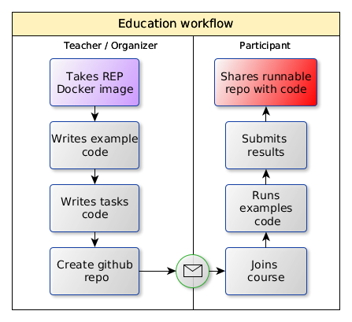

class: center, middle, no-number

.header[

]
.header-right[ 

]

&nbsp;

.title[Reproducible Machine Learning for Humans]

<!-- .remark-slide-number[abc] -->

.author[<u>Nikita Kazeev</u>1Andrey Ustyuzhanin1,2, Tim Head, Igor Babuschkin3, Alexander Tiunov2]

&nbsp;

&nbsp;
.date[2016-10-13, 4th National eScience Symposium]

&nbsp;

&nbsp;
.institution[1Yandex School of Data Analysis, 2Higher School of Economics NRU, 3University&nbsp;of&nbsp;Manchester]

---
## Irreproducibility indicators

.libig[
- ‘Which version of my code I used to generate figure 13?’
- ‘The new student wants to reuse that model I published three years ago but he can’t reproduce the figures’
- ‘I thought I’ve used the same parameters but I’m getting different results…’
- ‘On what dataset have I compared algorithms exactly?’
- ‘Why did I do that?!’
- ‘It worked yesterday!!’
]
---

## Reproducibility concern: psychology

.left-column[
.libig[
- 2011
- 250 scientists headed by Brian Nosek (Center of Open Science)
- 100 papers published in 2008 in three leading psychology journals
- https://osf.io/ezcuj/wiki/home/
- "only 39 could be reproduced"
]]
.right-column[
&nbsp;

]

.footnote-left[http://www.nature.com/news/first-results-from-psychology-s-largest-reproducibility-test-1.17433]

---
## Reproducibility concern: biology
.left-column[
.libig[
- 53 'landmark' papers in drug discovery
- 2012 by Amgen (US company)
- "confirmed in only 6 (11%) cases"
]]
.right-column[
.libig[
- 54 papers in cancer biology 2010-2012
- 2013
- US$1.6 million
- [results, spreadsheet](https://docs.google.com/spreadsheets/d/1V_znJ1zrYyWpmCLTL3dZU7QWcGAIOeyav_L6UGuFBkw/edit?pli=1#gid=0)
- .small[https://osf.io/e81xl/wiki/home/]
- to be completed by 2017
]]

.footnote-left[http://www.nature.com/nature/journal/v483/n7391/full/483531a.html

http://www.nature.com/news/cancer-reproducibility-project-scales-back-ambitions-1.18938
]

---
## Nature's Reproducibility Survey

.center[]

.footnote-left[
* [Nature: 1,500 scientists lift the lid on reproducibility](http://www.nature.com/news/1-500-scientists-lift-the-lid-on-reproducibility-1.19970) by Monya Baker
* [raw survey data (link)](https://figshare.com/articles/Nature_Reproducibility_survey/3394951/1)
]
---
background-image: url(images/the_boost.jpg)

---
## Rise of challenge-driven education

Learning by solving real-world problems in interdisciplinary & international projects.

- Imagine Cup, http://imaginecup.com/
- Hackathons, e.g., http://webfest.web.cern.ch/
- Open data days, http://opendataday.org/
- Guide to Challenge Driven Education, .small[https://www.kth.se/social/group/guide-to-challenge-d/]

Platforms (with plenty of examples):

- Kaggle, https://www.kaggle.com/
- Codalab, https://competitions.codalab.org/
- ...

--

#### Complication and boost factors are similar to research reproducibility.

---
## ...part of the story

#### _Computational experiment_ is a significant part of the experiment, that starts as data collected. Reproducibility of that part being just a partial answer can be aided technologically.

Possible effects (see previous slide):

- Practical
    - better mentoring/supervision
    - more within-lab validation
    - simplified external-lab validation
    - incentive for better practice
    - robust design
- Educational
    - wider access to the best practices 
    - better teaching

---
## HEP way

<!-- in 1950-s it was a nightmare: $\sim 10^5$ papers with false discoveries/year. (?)
So in contrast to life-sciences, significance of discovery: _p-value_ $\sim 10^{-6}$
 -->

+ __data__ storage
    + shared storage (XROOTD, AFS, EOS, CERNBOX)
- standardized __environment__
    - software: ROOT, minuit, RooFit, experiment-stack, ...
    - computational cluster (e.g. `lxplus`)
+ __code__ versioning repository (gitlab)
- advanced analysis approaches
    - blind analysis
    - reviews, cross-checks within group, inter-group collaboration
+ collaborative culture
    + q&a groups, experts
    + publishing workflow
- double experiment-checks

---
## Reproducibility meta-practices

.libig[
* early planning, pre-registering study
* literate programming
* open research/study
]

---
## Reproducibility key components

.libig[
- Basic assumptions (vocabulary)
- Data
- Environment + Resources (CPU/GPU)
- Code/scripts
- Workflow
- Automated intermediate results checks
- Final results (datasets, publications)
]

---
## Key missing part: environment version control

* language and OS agnostic,
* capture and restore environment configuration,
* run configurations

.center[]

would enable:
* workflow automation
* automated results re-validation

---
layout: false
class: center, inverse, no-number

### Example 

Running https://github.com/everware/everware-dimuon-example

<video src="downloads/m3.m4v" height=400 controls="true" autoplay="false" preload="">Sorry, printed version doesn't support animation. https://github.com/everware/everware-dimuon-example</video>

---
## How it works

- __resources__: wherever _everware_ is installed (Yandex)

- __data__: CERNBOX

--

- __environment__ management: 
    - conda or virtualenv
    - docker
--

- github: analysis __code__ versioning

--

- Jupyter(Hub): runs the code interactively (a-la __workflow__)

--

- continuous integration: intermediate __results checks__ & report

--

- __everware__: to rule them all (just a bunch of wrappers!)

<!-- > _Everything is open source, enough resources within free hosting options_
 -->
---
## Everware is ...

... about re-useable science, it allows people to jump right in to your research code. Lets you launch _Jupyter_ notebooks from a git repository with a click of a button. 

- https://github.com/everware
- https://everware.rep.school.yandex.net (Yandex instance)

Examples:
- algorithm meta-analysis, .small[https://github.com/openml/study_example]
- gravitational waves, .small[https://github.com/anaderi/GW150914]
- COMET, .small[https://github.com/yandexdataschool/comet-example-ci]

--

_Think of transition from procedural coding approach to object-oriented._

---
## Everware toolkit

.libig[
- set of command-line tools for basic environment hacking (docker)
- extension for _JupyterHub_:
    - spawner for building and running custom _docker_ images
- integrated with:
    + dockerhub
    + github (for authentication and repository interaction)
- similar to _mybinder.org_ but with focus on scientific research
- guidelines
]

---
## Pros &amp; cons

.left-column[
### Pros
- easier supervision/mentoring
- easier within-lab validation
- wider access to the best practices
- simplified cross-lab validation
- good incentive for formal reproduction
- _good thing for industry career track development_
- access to wider set of practices

### Cons
- learning a bit of (open-sourced) technology
- re-organize internal research process
- inner barrier for openness
- higher incentive for mindless _borrowing_
- divergence/potential learning curves
]
.right-column[

]

---
## Research workflow with everware

- User creates a git repository for his project
- User creates some code, notebooks, figures out what libraries he needs
- User creates `Dockerfile` where he writes all the dependencies for his code (use `everware-cli`)
- User creates `Makefile` that simplifies start
one of the targets in `Makefile` passes through all the essential steps of analysis
- (optional) User tests that his analysis is runnable by one of the CI systems (e.g. on travis, adding, `.travis.yml`)
- User tests that analysis is also runnable by everware
- User completes his research and checks that he/she can reproduce all the figures/tables supporting his hypothesis by running corresponding notebooks (or automates cascade of notebooks execution by single `Makefile` target)
- User publishes paper, filling-in special form link to his git repository and to everware that any member of the researcher community can pick-up from to improve his research

.footnote-center[.small[https://github.com/everware/everware/wiki/How-to-embed-everware-into-research-use-cases]]

---
## Education workflow with everware

<!-- .libig[
1. Teacher/organizer creates environment and publishes it on docker hub
2. Teacher creates challenge on one of the platforms (kaggle, codalab, etc)
3. Teacher creates github repository with code that runs in environment from (1) and publishes _baseline_ results to (2)
4. Teacher shares links 1-3 with students
] -->

.center[]
Tested on (some examples):

- Python course at YSDA 2015
- HEP Machine Learning summer school 2015-2016
- YSDA course on Machine learning at Imperial College London, 2016
- Kaggle competitions, 2016
- Machine learning course at University of Eindhoven
- LHCb open data masterclass

---
## Roadmap

.libig[
- Integrate with data sharing resources (zotero, figshare, etc)
- Automatic capture of environment (integrate with repro-zip)
- Integration with publishing resources ([gitxiv](https://gitxiv.com), re-science, [openml](https://openml.org))
- Not only jupyter-based computations
- .gray[Bring your own resources computational model]
]
---
## Conclusion

.libig[
- Reproducibility is not easy;
    - ...but is not that scary,
    - ...with a bit of openness,
    - and technology;
- _everware works_ for research and education (no people were harmed during testing);
    - easy to [try](https://everware.rep.school.yandex.net/hub/oauth_login?repourl=https://github.com/everware/everware-dimuon-example);
    - WIP, https://github.com/everware (open-source, care to join?);
    - See talk on LHCb open data masterclass for an extensive example.
]

---
layout: false
class: middle, center, inverse, no-number

# Thank you!

Andrey Ustyuzhanin, [anaderiru @ twitter](https://twitter.com/anaderi)

.footnote-center[Slideshow created using [remark](http://github.com/gnab/remark)]

---
count: false
layout: false
class: middle, center, inverse, no-number

### Backup slides

---
count: false
## Yandex School of Data Analysis is

- non commercial private university
https://yandexdataschool.com (separate from Yandex)
- 450+ students graduated since 2007
- Graduate students receive strong education in Data & Computer
Science (main supply of Yandex employees)
- Interest in interdisciplinary research – Data Science methods to
Information Retrieval and Fundamental Sciences
- organizes bi-yearly international Machine Learning Conference,
YAC https://yandexdataschool.com/conference/
- 25% of our students have background in Physics
- full member of LHCb since 2015, associate member during 2014-2015

---
count: false
### References

- http://www.nature.com/news/1-500-scientists-lift-the-lid-on-reproducibility-1.19970
- https://rescience.github.io/read/
- http://push.cwcon.org/
- https://openml.org
- https://figshare.com/
- https://gitlab.cern.ch/lhcb-bandq-exotics/Lb2LcD0K
- https://osf.io/ezcuj/wiki/home/
- https://osf.io/e81xl/wiki/home/
- Center for open science, https://cos.io/
- IPFS, https://github.com/ipfs/
- Nature, keyword: reproducibility, http://www.nature.com/news/reproducibility-1.17552

---
count: false
## Dealing with cognitive bias

.center[]

.small[http://go.nature.com/nqyohl]

<!--
background-image: url(images/crisis_by_field.jpg)

background-image: url(images/the_cause.jpg)
-->
